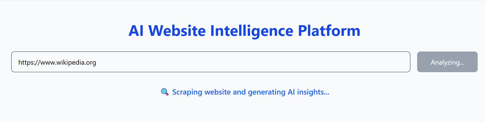
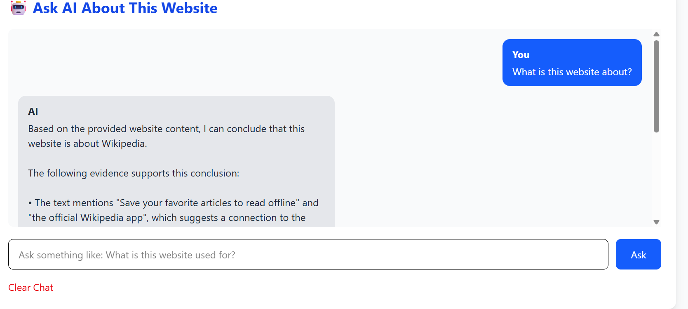

# AI-Powered Website Intelligence Platform

<<<<<<< HEAD


# AI-Powered Website Intelligence Platform

An AI-powered full-stack web application that analyzes any website URL and provides intelligent insights using web scraping, artificial intelligence, and SEO analysis.

The platform extracts website information, analyzes content using AI, detects technologies used in the website, evaluates SEO factors, and provides useful recommendations.

This project demonstrates Full Stack Development, REST API Development, Web Scraping, and AI Integration using React, FastAPI, and OpenAI technologies.
=======
<p align="center">
  
</p>

<p align="center">


</p>

---

# AI-Powered Website Intelligence Platform

An AI-powered Full Stack Web Application that analyzes any website URL and provides intelligent insights using **Artificial Intelligence**, **Web Scraping**, **SEO Analysis**, and **Retrieval-Augmented Generation (RAG)**.

The application extracts website content, analyzes it using Large Language Models (LLMs), detects technologies used by the website, evaluates SEO performance, stores analysis history, and enables users to ask AI-powered questions based on the extracted website content.

This project demonstrates modern Full Stack Development using **React, FastAPI, SQLite, LangChain, FAISS, Ollama**, and **BeautifulSoup**.

---

# Table of Contents

- Project Overview
- Features
- Technology Stack
- System Architecture
- Project Structure
- Installation
- Environment Variables
- Running the Project
- API Endpoints
- Screenshots
- Development Workflow
- Challenges & Solutions
- Learning Outcomes
- Future Enhancements
- License
- Author
>>>>>>> 63eaecd (Update README with screenshots and badges)

---

# Project Overview

<<<<<<< HEAD
The AI-Powered Website Intelligence Platform allows users to enter any website URL and receive detailed insights about the website.
=======
The AI-Powered Website Intelligence Platform allows users to analyze any website by entering its URL.
>>>>>>> 63eaecd (Update README with screenshots and badges)

The system automatically:

- Extracts website content
<<<<<<< HEAD
- Generates AI-based website analysis
- Detects technologies used
- Performs SEO evaluation
- Calculates website statistics
- Provides improvement recommendations

The objective of this project is to combine modern web development and artificial intelligence to build an automated website analysis tool.
=======
- Detects technologies used
- Performs SEO analysis
- Generates AI-powered summaries
- Creates a searchable knowledge base
- Stores website analysis history
- Answers questions using Retrieval-Augmented Generation (RAG)
>>>>>>> 63eaecd (Update README with screenshots and badges)

---

# Features

## Website Content Extraction

<<<<<<< HEAD
The application extracts important website information:

- Website Title
- Headings (H1, H2, H3)
- Paragraph Content
- Website Text Data
=======
The application extracts:

- Website Title
- Headings (H1–H6)
- Paragraphs
- Metadata
- Images
- Hyperlinks
- Website Statistics
>>>>>>> 63eaecd (Update README with screenshots and badges)


## AI Website Analysis

<<<<<<< HEAD
The extracted website content is analyzed using AI to generate:
=======
The AI module provides:
>>>>>>> 63eaecd (Update README with screenshots and badges)

- Website Summary
- Website Purpose
- Target Audience
<<<<<<< HEAD
- Main Topics
- SEO Suggestions
- Content Improvement Recommendations
=======
- Key Topics
- Content Insights
- Improvement Suggestions
>>>>>>> 63eaecd (Update README with screenshots and badges)


<<<<<<< HEAD
## SEO Analysis

The platform performs basic SEO evaluation by checking:

- Meta Description
- H1 Tag Presence
- Number of Images
- Image ALT Attributes
- SEO Score Calculation
=======
## RAG Question Answering

Ask questions like:

- What is this website about?
- Who is the target audience?
- Summarize this website.
- What technologies are used?

Powered by:

- LangChain
- FAISS Vector Database
- HuggingFace Embeddings
- Ollama Llama 3.2

---

## SEO Analysis

The application checks:

- Meta Description
- Page Title
- Heading Structure
- Images
- ALT Attributes
- SEO Score
>>>>>>> 63eaecd (Update README with screenshots and badges)


## Technology Detection

<<<<<<< HEAD
The system detects technologies used by websites based on HTML analysis.

Supported technologies:
=======
Detects technologies such as:
>>>>>>> 63eaecd (Update README with screenshots and badges)

- React
- Angular
- Vue
- Next.js
<<<<<<< HEAD
=======
- Nuxt
>>>>>>> 63eaecd (Update README with screenshots and badges)
- Bootstrap
- Tailwind CSS
- jQuery
- WordPress
- Shopify
- Cloudflare


## Website Statistics

<<<<<<< HEAD
The application provides:
=======
Displays:
>>>>>>> 63eaecd (Update README with screenshots and badges)

- Total Words
- Paragraph Count
<<<<<<< HEAD
- Estimated Reading Time
- Extracted Content Information
=======
- Reading Time
- Number of Images
- Links Found
>>>>>>> 63eaecd (Update README with screenshots and badges)


<<<<<<< HEAD
## AI Question Answering

The platform supports AI-based question answering over analyzed website content.

Users can ask questions like:

- What is this website about?
- Who is the target audience?
- What improvements are required?
=======
## Website History

Stores previous analyses using SQLite.

Saved data:

- Website URL
- Website Title
- AI Summary
- SEO Score
- Date & Time
>>>>>>> 63eaecd (Update README with screenshots and badges)

---

# Technology Stack

## Frontend

- React.js
- Vite
- Tailwind CSS
- Axios
- JavaScript

<<<<<<< HEAD

=======
>>>>>>> 63eaecd (Update README with screenshots and badges)
## Backend

- Python
- FastAPI
- Uvicorn

<<<<<<< HEAD
=======
## AI & RAG

- LangChain
- FAISS
- HuggingFace Embeddings
- Ollama Llama 3.2
>>>>>>> 63eaecd (Update README with screenshots and badges)

## Web Scraping

- Requests
- BeautifulSoup4

<<<<<<< HEAD
=======
## Database
>>>>>>> 63eaecd (Update README with screenshots and badges)

- SQLite
- SQLAlchemy

<<<<<<< HEAD
- OpenAI API
- LangChain
- FAISS
- HuggingFace Embeddings
- Ollama LLM
=======
## Version Control

- Git
- GitHub

---

# System Architecture
>>>>>>> 63eaecd (Update README with screenshots and badges)

```mermaid
graph TD

<<<<<<< HEAD
## Database

- SQLite
- SQLAlchemy


## Version Control

- Git
- GitHub

=======
A[User] --> B[React Frontend]
B --> C[Axios API]
C --> D[FastAPI Backend]
D --> E[Website Scraper]
E --> F[BeautifulSoup]
F --> G[SEO Analysis]
F --> H[Technology Detection]
F --> I[AI Analysis]
I --> J[LangChain]
J --> K[FAISS Vector Database]
K --> L[Ollama Llama 3.2]
L --> M[AI Response]
D --> N[SQLite Database]
M --> O[Frontend Dashboard]
```
>>>>>>> 63eaecd (Update README with screenshots and badges)

---

# Project Structure

<<<<<<< HEAD
```
AI-Powered-Website-Analysis-Platform/
=======
```text
AI-Powered-Website-Intelligence-Platform/
>>>>>>> 63eaecd (Update README with screenshots and badges)

│
├── frontend/
│   ├── src/
│   │   ├── components/
<<<<<<< HEAD
│   │   │
│   │   │   ├── Navbar.jsx
│   │   │   ├── Hero.jsx
│   │   │   ├── UrlForm.jsx
│   │   │   ├── ResultCard.jsx
│   │   │   ├── QuestionBox.jsx
│   │   │   └── History.jsx
│   │   │
│   │   ├── services/
│   │   │   └── api.js
│   │   │
=======
│   │   ├── pages/
│   │   ├── services/
>>>>>>> 63eaecd (Update README with screenshots and badges)
│   │   ├── App.jsx
│   │   └── main.jsx
│   ├── public/
│   └── package.json
│
├── backend/
│   ├── ccs/
│   │   ├── home page.png
│   │   ├── analyzing.png
│   │   ├── output3.png
│   │   └── Screenshot 2026-07-27 222818.png
│   │
│   ├── main.py
│   ├── ai.py
│   ├── rag.py
│   ├── scraper.py
│   ├── database.py
│   ├── requirements.txt
│   └── .env
│
├── README.md
└── .gitignore

```

---

# Installation

## 1. Clone Repository

```bash
<<<<<<< HEAD
git clone https://github.com/rvitmonisha/AI-Powered-Website-Analysis-Platform.git
=======
git clone https://github.com/rvitmonisha/AI-Powered-Website-Intelligence-Platform.git
>>>>>>> 63eaecd (Update README with screenshots and badges)
```

Navigate to project

```bash
<<<<<<< HEAD
cd AI-Powered-Website-Analysis-Platform
=======
cd AI-Powered-Website-Intelligence-Platform
>>>>>>> 63eaecd (Update README with screenshots and badges)
```

---

# Backend Setup

<<<<<<< HEAD
Navigate to backend:
=======
Move to backend
>>>>>>> 63eaecd (Update README with screenshots and badges)

```bash
cd backend
```

Create virtual environment

```bash
python -m venv venv
```

<<<<<<< HEAD
Activate virtual environment:
=======
Activate environment
>>>>>>> 63eaecd (Update README with screenshots and badges)

Windows

```powershell
.\venv\Scripts\Activate.ps1
```

Linux / Mac

```bash
<<<<<<< HEAD
=======
source venv/bin/activate
```

Install dependencies

```bash
>>>>>>> 63eaecd (Update README with screenshots and badges)
pip install -r requirements.txt
```

---

# Environment Variables

<<<<<<< HEAD
Create a `.env` file inside the backend folder.

Add:

```env
OPENAI_API_KEY=your_api_key_here
```

The API key is stored securely using environment variables.
=======
Create a `.env`

```env
OPENAI_API_KEY=your_api_key
```

If using Ollama locally

```env
OLLAMA_BASE_URL=http://localhost:11434
```
>>>>>>> 63eaecd (Update README with screenshots and badges)

---

# Run Backend

<<<<<<< HEAD
Start FastAPI server:

=======
>>>>>>> 63eaecd (Update README with screenshots and badges)
```bash
uvicorn main:app --reload
```

Backend URL

```
http://127.0.0.1:8000
```

---

# Frontend Setup

Open another terminal

<<<<<<< HEAD
Navigate to frontend:

=======
>>>>>>> 63eaecd (Update README with screenshots and badges)
```bash
cd frontend
```

Install packages

```bash
npm install
```

<<<<<<< HEAD
Run React application:
=======
Run React
>>>>>>> 63eaecd (Update README with screenshots and badges)

```bash
npm run dev
```

Frontend URL

```
http://localhost:5173
```

---

# API Endpoints

## Health Check

### GET /
<<<<<<< HEAD

Response:
=======
>>>>>>> 63eaecd (Update README with screenshots and badges)

```json
{
  "message":"Backend is running!"
}
```


<<<<<<< HEAD
## Website Analysis
=======
## Analyze Website
>>>>>>> 63eaecd (Update README with screenshots and badges)

### POST /scrape

Request

```json
{
  "url":"https://example.com"
}
```

<<<<<<< HEAD
Response includes:

- Website title
- Extracted content
- AI analysis
- Technology detection
- SEO information
- Website statistics
=======
Returns

- Website Title
- Extracted Content
- SEO Report
- AI Summary
- Technologies Used
- Statistics
>>>>>>> 63eaecd (Update README with screenshots and badges)


<<<<<<< HEAD
## AI Question Answering

### POST /ask

Request:
=======
## Ask AI

### POST /ask
>>>>>>> 63eaecd (Update README with screenshots and badges)

```json
{
  "question":"Summarize this website."
}
```

<<<<<<< HEAD
Response:

```json
{
 "answer":"AI generated response"
=======
Returns

```json
{
   "answer":"AI Generated Response"
>>>>>>> 63eaecd (Update README with screenshots and badges)
}
```

---

<<<<<<< HEAD
# System Architecture

```
User

   |

React Frontend

   |

Axios API Request

   |

FastAPI Backend

   |

Website Scraper

   |

BeautifulSoup Extraction

   |

AI Analysis Module

   |

Response Dashboard

```

---

# Development Workflow

The project was developed using the following steps:

1. Created React application using Vite.
2. Designed reusable React components.
3. Added Tailwind CSS styling.
4. Integrated Axios for API communication.
5. Developed FastAPI backend.
6. Implemented website scraping using BeautifulSoup.
7. Added SEO analysis features.
8. Added technology detection.
9. Integrated OpenAI API.
10. Implemented AI question answering.
11. Added SQLite database support.
12. Managed project using Git and GitHub.

---

---

# Screenshots

## Home Page

The main interface where users enter a website URL for analysis.


## Website Analysis Result

Displays extracted website information, technologies detected, SEO details, and statistics.


## AI Website Analysis

AI-generated insights including website purpose, target audience, SEO suggestions, and improvements.


## SEO Analysis

Shows SEO evaluation based on metadata, headings, images, and optimization factors.


=======
## Website History

### GET /history

Returns all previous website analyses.

---

# Screenshots

## Home Page

<p align="center">

</p>

Users enter any website URL for AI-powered analysis.

---

## Website Analysis

<p align="center">

</p>

Displays website information, technology detection, and statistics.

---

## AI Analysis

<p align="center">

</p>

AI-generated summary, target audience, recommendations, and insights.

---

## SEO Analysis

<p align="center">

</p>

SEO evaluation including metadata, headings, ALT tags, and SEO score.

---
# Development Workflow

The project was developed in the following stages:

1. Designed the frontend using React and Vite.
2. Built reusable UI components with Tailwind CSS.
3. Connected frontend and backend using Axios.
4. Developed REST APIs using FastAPI.
5. Implemented website scraping with Requests and BeautifulSoup.
6. Added website content extraction.
7. Implemented SEO analysis.
8. Added technology stack detection.
9. Integrated AI-powered website analysis.
10. Built a Retrieval-Augmented Generation (RAG) pipeline.
11. Used LangChain for document processing.
12. Stored embeddings using FAISS.
13. Integrated Ollama Llama 3.2 for question answering.
14. Implemented SQLite database for storing website analysis history.
15. Tested and optimized the application.
>>>>>>> 63eaecd (Update README with screenshots and badges)

---

# Challenges Faced and Solutions

## 1. Cross-Origin Resource Sharing (CORS)

### Problem

<<<<<<< HEAD
Frontend requests were blocked by browser CORS restrictions.
=======
Frontend API requests were blocked due to browser security restrictions.
>>>>>>> 63eaecd (Update README with screenshots and badges)

### Solution

Configured FastAPI `CORSMiddleware` to allow requests from the React frontend.


<<<<<<< HEAD
## Website Blocking Requests
=======
## 2. Website Scraping Restrictions
>>>>>>> 63eaecd (Update README with screenshots and badges)

### Problem

<<<<<<< HEAD
Some websites restrict automated scraping.
=======
Some websites block automated scraping requests.
>>>>>>> 63eaecd (Update README with screenshots and badges)

### Solution

<<<<<<< HEAD
Implemented:
=======
- Added custom User-Agent headers
- Implemented timeout handling
- Added exception handling for inaccessible websites
>>>>>>> 63eaecd (Update README with screenshots and badges)

- User-Agent headers
- Request timeout handling

<<<<<<< HEAD

## AI API Key Security
=======
## 3. AI Response Quality
>>>>>>> 63eaecd (Update README with screenshots and badges)

### Problem

<<<<<<< HEAD
API keys should not be exposed publicly.
=======
Large Language Models may generate responses unrelated to the website.
>>>>>>> 63eaecd (Update README with screenshots and badges)

### Solution

<<<<<<< HEAD
Stored API keys using environment variables and `.env` files.
=======
Implemented Retrieval-Augmented Generation (RAG) using LangChain and FAISS so responses are generated only from the extracted website content.
>>>>>>> 63eaecd (Update README with screenshots and badges)


<<<<<<< HEAD
## Different Website Structures
=======
## 4. Technology Detection
>>>>>>> 63eaecd (Update README with screenshots and badges)

### Problem

<<<<<<< HEAD
Websites have different HTML structures.
=======
Different websites use different frameworks and libraries.
>>>>>>> 63eaecd (Update README with screenshots and badges)

### Solution

<<<<<<< HEAD
Implemented flexible HTML parsing using BeautifulSoup.
=======
Implemented HTML-based technology detection using keywords and metadata analysis.

---

## 5. Data Storage

### Problem

Website analysis history needed to persist after the application closed.

### Solution

Implemented SQLite with SQLAlchemy ORM for storing website history.
>>>>>>> 63eaecd (Update README with screenshots and badges)

---

# Key Learning Outcomes

## Frontend Development

<<<<<<< HEAD
- React component development
- API integration using Axios
- Responsive UI development
- Tailwind CSS


## Backend Development

- FastAPI REST API development
- Request handling
- Data validation
- CORS configuration


## Artificial Intelligence

- AI API integration
- Prompt engineering
- RAG architecture concepts
- Vector search concepts


## Web Scraping

- HTML parsing
- Website data extraction
- SEO information collection


## Software Engineering

- Git workflow
- Documentation
- Environment management
=======
- React.js Development
- Tailwind CSS
- Component-Based Architecture
- Axios API Integration
- Responsive UI Design

---

## Backend Development

- FastAPI
- REST API Development
- Request Validation
- Error Handling
- CORS Configuration

---

## Artificial Intelligence

- Prompt Engineering
- LangChain Framework
- HuggingFace Embeddings
- Vector Databases (FAISS)
- Retrieval-Augmented Generation (RAG)
- Local Large Language Models (Ollama)

---

## Web Scraping

- Requests Library
- BeautifulSoup
- HTML Parsing
- Metadata Extraction
- Website Content Analysis

---

## Database

- SQLite
- SQLAlchemy ORM
- CRUD Operations
- Database Design

---

## Software Engineering

- Git & GitHub
- Version Control
- Project Documentation
- Environment Variable Management
- Modular Code Structure
>>>>>>> 63eaecd (Update README with screenshots and badges)

---

# Future Enhancements

<<<<<<< HEAD
Planned improvements:

- Advanced SEO scoring
- User authentication
- Cloud deployment
- Better technology detection
- More AI model support
- Improved RAG pipeline
- Export website analysis reports


---

# Project Objective

The objective of this project is to build an intelligent website analysis platform combining:

- Full Stack Development
- Artificial Intelligence
- Natural Language Processing
- Web Scraping
- REST API Development


This project demonstrates practical implementation of modern software engineering and AI technologies.
=======
Planned improvements include:

- User Authentication
- PDF Report Generation
- Export Website Analysis
- AI Chat History
- Multi-Website Comparison
- Advanced SEO Scoring
- Website Performance Analysis
- Cloud Deployment
- Docker Support
- CI/CD Integration
- Multi-language Support
- AI Agent for Autonomous Website Analysis

---

# License

This project is licensed under the **MIT License**.

Feel free to use, modify, and distribute this project for educational and personal purposes.
>>>>>>> 63eaecd (Update README with screenshots and badges)

---

# Author

## M N Monisha

**Computer Science Engineering Student**

### Connect with me

- GitHub: https://github.com/rvitmonisha


---


<p align="center">
Made with  using React, FastAPI, LangChain, Ollama, FAISS, and BeautifulSoup.
</p>