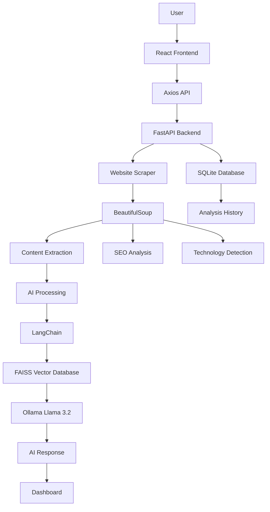

# AI-Powered Website Intelligence Platform


<p align="center">

</p>


<p align="center">


</p>


---

# Project Overview


The **AI-Powered Website Intelligence Platform** is an AI-based full-stack web application that analyzes any website URL and provides intelligent insights.


The platform combines:


- Artificial Intelligence
- Web Scraping
- SEO Analysis
- Technology Detection
- Retrieval-Augmented Generation (RAG)


The system extracts website content, analyzes it using AI models, generates summaries, detects technologies, evaluates SEO performance, stores history, and allows users to ask questions about the website.


This project demonstrates modern full-stack development using:


- React.js
- FastAPI
- SQLite
- LangChain
- FAISS
- Ollama
- BeautifulSoup


---

#  Features


##  Website Content Extraction


The application extracts:


- Website Title
- Headings (H1-H6)
- Paragraph Content
- Metadata
- Images
- Hyperlinks
- Word Count
- Reading Time


---

## AI Website Analysis


The AI engine generates:


- Website Summary
- Website Purpose
- Target Audience
- Important Topics
- Content Insights
- Improvement Suggestions


---

##  AI Question Answering using RAG


Users can ask questions based on website content:


Example:


```
What is this website about?

Who is the target audience?

Summarize this website.

What technologies are used?
```


Implemented using:


- LangChain
- FAISS Vector Database
- HuggingFace Embeddings
- Ollama Llama 3.2


---

## SEO Analysis


The platform analyzes:


- Meta Description
- Page Title
- Heading Structure
- Image ALT Attributes
- SEO Score
- Optimization Suggestions


---

##  Technology Detection


Detects technologies used by websites:


- React
- Angular
- Vue
- Next.js
- Bootstrap
- Tailwind CSS
- jQuery
- WordPress
- Shopify
- Cloudflare
- Google Analytics


---

##  Website Statistics


Displays:


- Total Words
- Paragraph Count
- Reading Time
- Image Count
- Link Count


---

#  Technology Stack


## Frontend


- React.js
- Vite
- Tailwind CSS
- Axios
- JavaScript


## Backend


- Python
- FastAPI
- Uvicorn
- REST API


## AI & RAG


- LangChain
- FAISS
- HuggingFace Embeddings
- Ollama Llama 3.2
- Retrieval-Augmented Generation


## Web Scraping


- BeautifulSoup4
- Requests
- HTML Parsing


## Database


- SQLite
- SQLAlchemy


## Tools


- Git
- GitHub
- VS Code


---

#  System Architecture





---

#  Project Structure


```
AI-Powered-Website-Intelligence-Platform/

│
├── frontend/
│
│   ├── src/
│   │
│   ├── components/
│   ├── pages/
│   ├── services/
│   ├── App.jsx
│   └── main.jsx
│
│
├── backend/
│
│   ├── ccs/
│   │
│   │   ├── home-page.png
│   │   ├── analyzing.png
│   │   ├── output3.png
│   │   └── seo-analysis.png
│   │
│   ├── main.py
│   ├── scraper.py
│   ├── ai.py
│   ├── rag.py
│   ├── database.py
│   ├── requirements.txt
│   └── .env
│
│
├── README.md
└── .gitignore

```


---

#  Installation


## Clone Repository


```bash
git clone https://github.com/rvitmonisha/AI-Powered-Website-Intelligence-Platform.git
```


Move into project:


```bash
cd AI-Powered-Website-Intelligence-Platform
```


---

#  Backend Setup


Go to backend:


```bash
cd backend
```


Create virtual environment:


```bash
python -m venv venv
```


Activate environment:


### Windows


```powershell
.\venv\Scripts\Activate.ps1
```


### Linux / Mac


```bash
source venv/bin/activate
```


Install dependencies:


```bash
pip install -r requirements.txt
```


---

#  Environment Variables


Create `.env` file inside backend:


```
OLLAMA_BASE_URL=http://localhost:11434
```


---

#  Ollama Setup


Install Ollama:


https://ollama.com/


Download Llama model:


```bash
ollama pull llama3.2
```


Start Ollama:


```bash
ollama serve
```


---

#  Run Backend


```bash
uvicorn main:app --reload
```


Backend runs:


```
http://127.0.0.1:8000
```


---

#  Frontend Setup


Open another terminal:


```bash
cd frontend
```


Install packages:


```bash
npm install
```


Run application:


```bash
npm run dev
```


Frontend runs:


```
http://localhost:5173
```


---

#  API Endpoints


## Health Check


```
GET /
```


Response:


```json
{
"message":"Backend is running!"
}
```


---

## Analyze Website


```
POST /scrape
```


Request:


```json
{
"url":"https://example.com"
}
```


Returns:


- Website information
- AI summary
- SEO report
- Technology details
- Statistics


---

## Ask AI


```
POST /ask
```


Request:


```json
{
"question":"Summarize this website"
}
```


---

#  Screenshots


## Home Page


<p align="center">

</p>


## Website Analysis


<p align="center">

</p>


## AI Insights


<p align="center">

</p>


## SEO Analysis


<p align="center">

</p>


---

#  Development Workflow


1. Designed React frontend.
2. Built responsive UI components.
3. Created FastAPI backend APIs.
4. Implemented website scraping.
5. Added SEO analysis.
6. Added technology detection.
7. Integrated AI analysis.
8. Built RAG pipeline.
9. Added FAISS vector search.
10. Integrated Ollama LLM.
11. Added SQLite database.
12. Tested and optimized application.


---

#  Challenges & Solutions


## Website Scraping Restrictions


Problem:

Some websites block automated requests.


Solution:


- Added User-Agent headers
- Added timeout handling
- Added error handling


---

## AI Hallucination


Problem:

AI may generate unrelated answers.


Solution:


Implemented RAG architecture using LangChain and FAISS.


---

## Data Storage


Problem:

Analysis history needed permanent storage.


Solution:


Implemented SQLite database using SQLAlchemy.


---

#  Learning Outcomes


## Frontend Development


- React.js
- Vite
- Tailwind CSS
- Axios
- Component Architecture


## Backend Development


- FastAPI
- REST API
- CORS
- Error Handling


## Artificial Intelligence


- LangChain
- RAG Architecture
- Vector Database
- LLM Integration


## Web Scraping


- BeautifulSoup
- HTML Parsing
- Metadata Extraction


## Database


- SQLite
- SQLAlchemy
- CRUD Operations


---

# 🔮 Future Enhancements


- User Authentication
- PDF Report Generation
- Website Comparison
- Advanced SEO Scoring
- Website Performance Analysis
- Docker Support
- Cloud Deployment
- CI/CD Pipeline
- AI Website Monitoring
- Multi-language Support


---

#  License


This project is licensed under the MIT License.


---

#  Author


## M N Monisha


Computer Science Engineering Student


GitHub:

https://github.com/rvitmonisha


---

<p align="center">

Made with  using React, FastAPI, LangChain, Ollama, FAISS and BeautifulSoup.

</p>